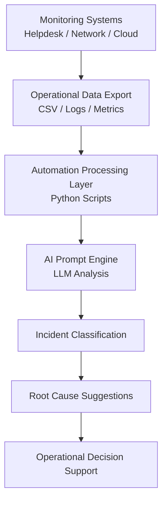
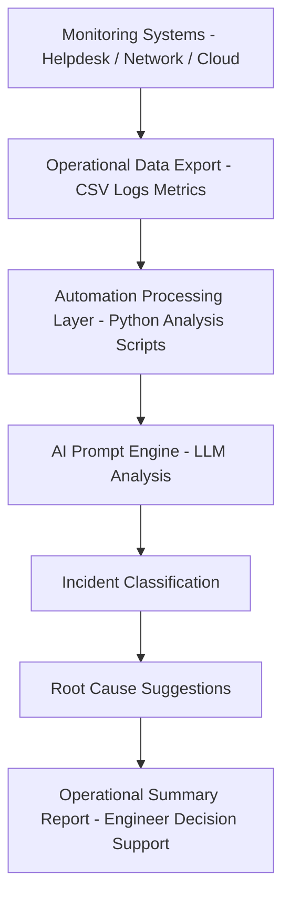

# Healthcare AI Operations Playbook


AI-driven operational automation frameworks demonstrating how artificial intelligence can assist IT operations teams with analyzing infrastructure data and supporting incident response workflows.

This repository demonstrates practical examples of AI-assisted automation applied to:

• Helpdesk operations  
• Network incident analysis  
• Cloud infrastructure monitoring  

All datasets included in this repository are fictional and used only for demonstration and educational purposes.

---

## AI Operations Platform Overview



---

# Project Modules

## 1. AI Helpdesk Automation

Location:

`ai-helpdesk-automation`

This module demonstrates how AI can assist IT helpdesk teams by:

- Categorizing support tickets
- Summarizing recurring issues
- Suggesting troubleshooting steps

Components included:

- Ticket dataset
- Python automation script
- AI prompt library

---

## 2. AI Network Incident Analysis

Location:

`ai-network-incident-analysis`

This module demonstrates how AI can assist Network Operations teams by analyzing infrastructure alerts.

Capabilities demonstrated:

- Incident classification
- Infrastructure alert analysis
- Root cause suggestions
- Troubleshooting recommendations

Components included:

- Network alert dataset
- Python incident summary script
- AI analysis prompts

---

# Example Workflow

Monitoring Systems  
↓  
Alert or Ticket Export  
↓  
Automation Script Processing  
↓  
AI Analysis  
↓  
Operational Summary Report

---
## AI Operations Workflow Architecture

The diagram below illustrates how operational data flows through automation scripts and AI analysis to support IT operations teams.



## How the Workflow Works

1. **Monitoring Systems**  
Infrastructure monitoring tools generate alerts from helpdesk systems, network devices, and cloud platforms.

2. **Operational Data Export**  
Alerts and events are exported into structured formats such as CSV files, logs, or monitoring metrics.

3. **Automation Processing Layer**  
Python scripts analyze operational data to identify patterns, summarize incidents, and categorize events.

4. **AI Prompt Engine**  
AI models evaluate the processed data using structured prompts to assist with analysis.

5. **Incident Classification**  
The AI system categorizes the incident type based on operational signals.

6. **Root Cause Suggestions**  
AI proposes likely root causes and troubleshooting steps for engineers.

7. **Operational Summary Report**  
Engineers receive a summarized report that supports decision-making and incident response.

---

## Running the Example Scripts

The modules in this repository include simple Python scripts that demonstrate how operational data can be analyzed and summarized.

### Network Incident Analysis Example

Navigate to the network analysis module:

```
cd ai-network-incident-analysis/scripts
```

Run the incident report generator:

```
python generate_incident_report.py
```

Example output:

```
AI-Style Incident Report
========================

Total alerts analyzed: 5
Most common alert type: connectivity
Most frequent severity level: high
```

---

### Helpdesk Automation Example

Navigate to the helpdesk module:

```
cd ai-helpdesk-automation/scripts
```

Run the helpdesk report generator:

```
python generate_helpdesk_report.py
```

Example output:

```
AI Helpdesk Operational Report
==============================

Total tickets analyzed: 8
Most common issue category: network access
Most frequent priority level: medium
```

---

## Operational Value

AI-assisted automation can help organizations:

- Reduce mean time to resolution (MTTR)
- Improve incident classification accuracy
- Identify recurring infrastructure problems
- Provide engineers with faster troubleshooting insights

---
---

## Running the Example Scripts

### Run the Full AI Operations Demo

From the root of the repository, run:

```bash
python run_ai_operations_demo.py
```

This will execute both:

- the Helpdesk Operational Report generator
- the Network Incident Report generator

and print the combined output to the terminal.

---

### Network Incident Analysis Example

Navigate to the network analysis module:

```
cd ai-network-incident-analysis/scripts
```

Run the incident report generator:

```
python generate_incident_report.py
```

---

### Helpdesk Automation Example

Navigate to the helpdesk module:

```
cd ai-helpdesk-automation/scripts
```

Run the helpdesk report generator:

```
python generate_helpdesk_report.py
```

## License

This project is licensed under the MIT License.
