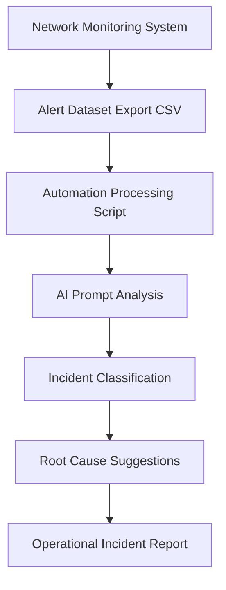

### Additional Reporting Script

This module also includes:

`scripts/generate_incident_report.py`

The script reads the fictional network alert dataset and generates a short incident-style report showing:

- total alerts analyzed
- most common alert type
- severity breakdown
- an operational summary

This demonstrates how automation can support AI-assisted incident reporting workflows.
---

## Network Incident AI Workflow

